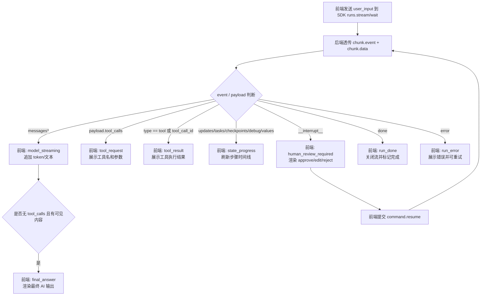
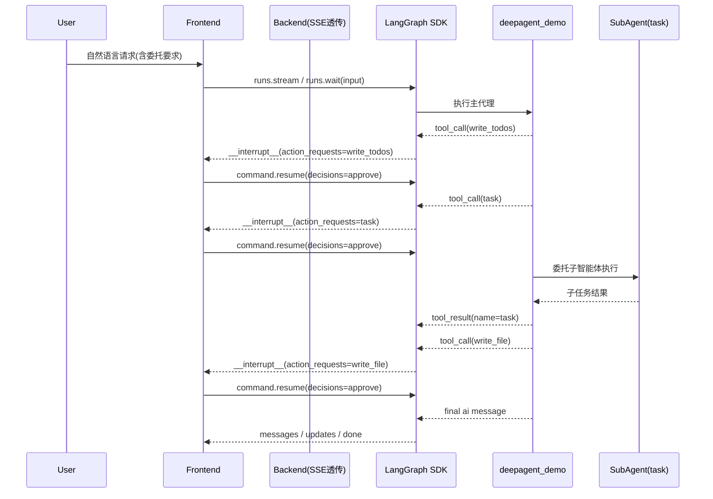

# Streaming 前后端对接规范（LangGraph / SDK）

## 0. 目标

定义一份可直接落地的 Streaming 协议与判定标准，保证前端对事件消费稳定、可回放、可测试。

协议原则：优先使用 LangGraph SDK 官方输出类型（`chunk.event` / `chunk.data` / `__interrupt__`），不额外自定义一套事件协议。

官方依据：

- https://docs.langchain.com/oss/python/langgraph/streaming
- https://docs.langchain.com/langsmith/streaming

## 1. 后端协议（当前项目）

现状实现：`sdk_src/examples/langgraph_fastapi_observer.py`

- `GET /api/chat/stream`
- SSE 透传：`event = chunk.event`，`data = chunk.data`
- 结束信号：额外发 `event: done`
- 异常信号：额外发 `event: error`

说明：`done/error` 是传输层补充；业务判定仍基于官方 `chunk.event/chunk.data` 与 run 输出字段。

## 2. stream_mode 标准

建议默认：

```text
messages,updates,tasks,checkpoints,debug
```

按需补充：

- `values`：看完整状态快照
- `custom`：发送计划进度等结构化业务事件

## 3. 前端状态机（推荐）

```text
run_started
  -> model_streaming
  -> tool_calling
  -> tool_completed
  -> final_answer
  -> run_done
```

失败分支：任意状态 -> `run_error`

## 3.2 SDK 事件 -> 前端行为交互图



上图原则：前端尽量只消费官方 SDK 语义（`event/data/__interrupt__`），不额外发明业务事件类型。

文字说明：

- `messages*` 对应“模型正在输出”，用于增量渲染。
- `tool_calls` 表示“准备调用工具”；`type == tool` 表示“工具已执行并返回”。
- `updates/tasks/checkpoints/debug/values` 统一视为执行进度，不与业务语义耦合。
- `__interrupt__` 是人工审批入口；前端按 `allowed_decisions` 渲染按钮并提交 `command.resume`。
- `done/error` 是流传输终态；最终答案仍由官方消息结构判断（`type == ai` 且无 `tool_calls`）。

## 3.3 DeepAgent 子智能体委托时序图（task）



判定要点：

- 子智能体委托请求：消息中的 `tool_calls[].name == "task"`。
- 子智能体委托结果：消息中的 `type == "tool" and name == "task"`。
- 人工打断链：每次 `__interrupt__` 都对应一次待审批动作，直到 `done`。

## 3.1 不细分时的最小分类（推荐）

如果前端先做最小可用版本，stream 输出可先归为 6 类：

1. `user_input`：run 请求体中的用户输入（通常不在流中逐条回放）
2. `ai_stream`：模型流式输出（`messages*`）
3. `tool_request`：工具调用请求（出现 `tool_calls`）
4. `tool_result`：工具执行结果（`type == "tool"` 或含 `tool_call_id`）
5. `state_progress`：图执行进度（`updates/tasks/checkpoints/debug/values`）
6. `run_terminal`：运行终态（`done` / `error` / `__interrupt__`）

## 4. 事件分类规则（机读）

1. 模型 token / 文本流
- 信号：`event` 以 `messages` 开头（例如 `messages` / `messages/metadata` / `messages/partial`）
- 重点字段：`metadata.langgraph_node`

2. 工具调用请求
- 信号：消息中出现 `tool_calls`

3. 工具执行结果
- 信号：消息 `type == "tool"` 或出现 `tool_call_id`

4. 最终 AI 输出
- 信号：消息 `type == "ai"` 且无 `tool_calls`，并有可见内容

5. 运行结束
- 信号：SSE `done`

## 5. 工具来源分层（重点）

```text
if tool_name == "write_todos":
    source = "deepagent_todo"
elif tool_name in {"ls","read_file","write_file","edit_file","glob","grep"}:
    source = "deepagent_fs"
elif tool_name in LOCAL_TOOL_WHITELIST:
    source = "local_tool"
elif tool_name in MCP_TOOL_WHITELIST:
    source = "mcp_tool"
else:
    source = "unknown_tool"
```

说明：MCP 在事件层本质仍是工具调用，来源区分要靠工具名/白名单，不是靠事件类型。

## 6. 边界与坑位

1. `join_stream` 不会补发加入前的历史事件；加入时机偏晚时可能观测到 0 条尾流事件。
2. 单次 run 请求中不要同时混用 `context` 与 `configurable`。
3. Python < 3.11 的 async 场景有额外 streaming 约束（官方已说明）。

## 7. 测试映射

本仓对应自动化：`tests/test_streaming_stage_s1.py` + `tests/test_streaming_stage_s2.py` + `tests/test_streaming_stage_s3_hitl_time_travel.py` + `tests/test_streaming_stage_s4_unified_contract.py`

- 基础闭环：stream + wait + state
- 扩展校验：`messages` metadata、工具调用链顺序
- 进阶语义：`subgraphs` 能力探测/兼容契约、`join_stream` 尾流重接（含 0 事件边界）、机读分类规则
- S3 语义：`interrupt/command/checkpoint_id/update_state` 能力探测与 time-travel 兼容降级
- S4 综合：自然语言输入、LLM 流式输出、工具请求/结果、AI 最终输出、ToDo 分类、DeepAgent HITL 恢复、join_stream 边界

执行：

```bash
uv run --with pytest pytest tests/test_streaming_stage_s1.py tests/test_streaming_stage_s2.py tests/test_streaming_stage_s3_hitl_time_travel.py tests/test_streaming_stage_s4_unified_contract.py -vv -s
```
